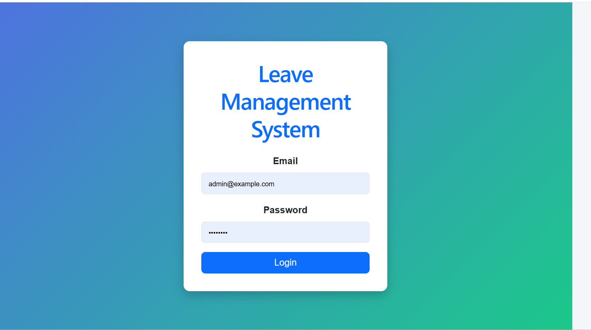
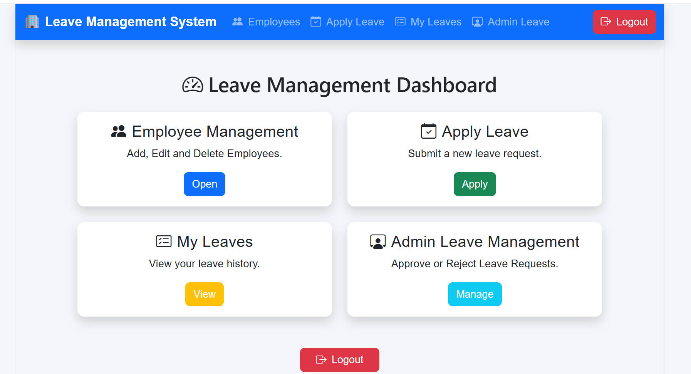
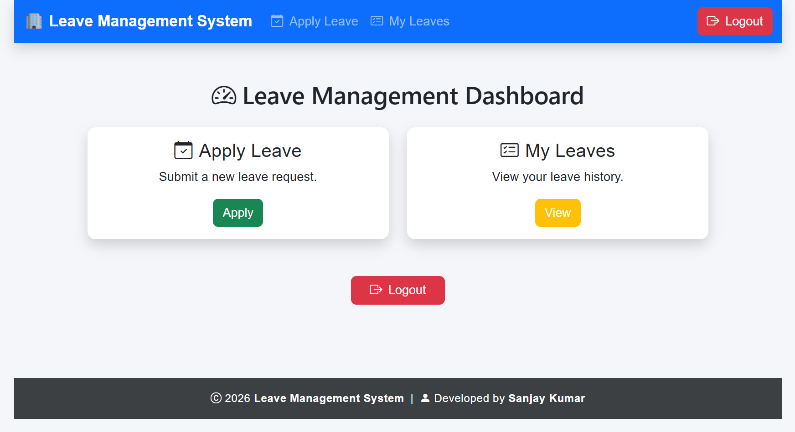
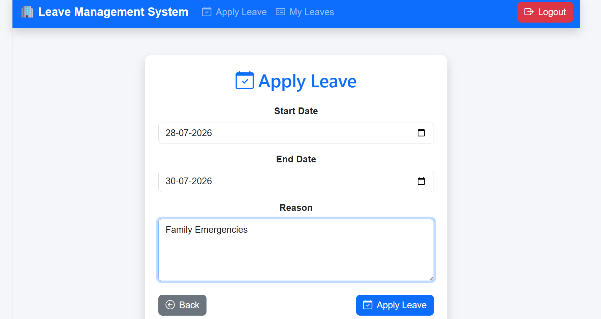
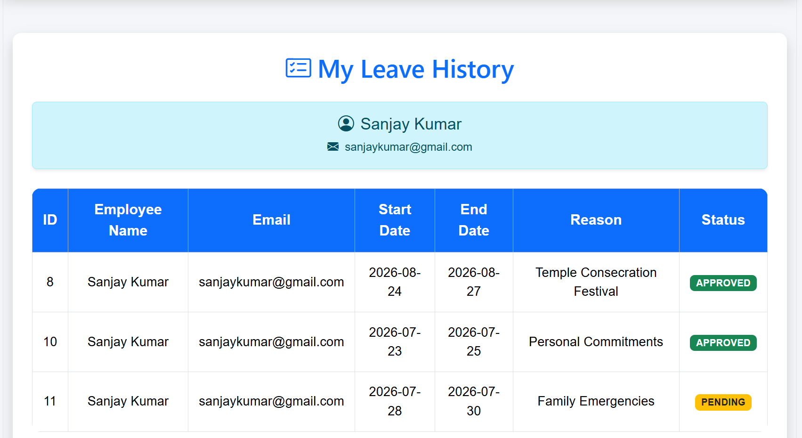
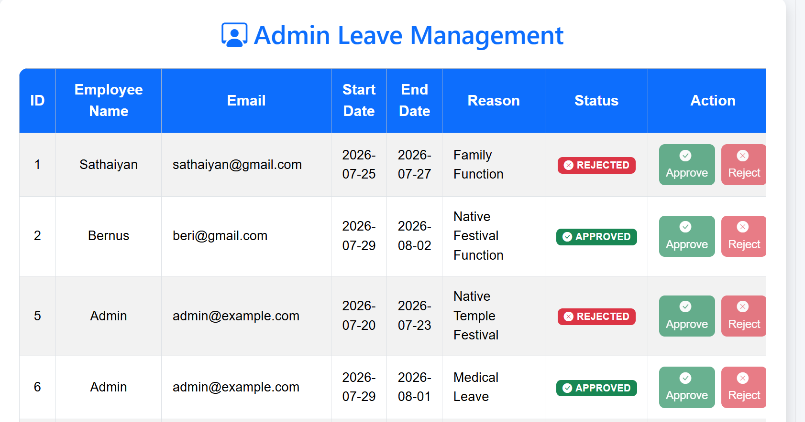

# Leave Management System

A full-stack Leave Management System that streamlines the leave request process within an organization. The application provides secure authentication, role-based authorization, employee management, and leave approval workflows through a modern web interface.

## Overview

This project is designed to automate leave management for organizations by eliminating manual leave tracking. Employees can submit leave requests and monitor their status, while administrators can manage employee records and approve or reject leave applications.

The application follows a client-server architecture with a React frontend communicating with a Spring Boot REST API secured using JWT authentication.

---

## Features

### Authentication
- JWT-based Authentication
- Secure Login
- BCrypt Password Encryption
- Role-Based Authorization
- Protected REST APIs

### Employee
- Login
- Apply for Leave
- View Leave History
- Track Leave Status

### Administrator
- Dashboard
- Employee Management (Create, Read, Update, Delete)
- View All Leave Requests
- Approve Leave Requests
- Reject Leave Requests

---

## Technology Stack

| Layer | Technology |
|--------|------------|
| Frontend | React, Vite, Bootstrap 5, Axios |
| Backend | Spring Boot, Spring Security, Spring Data JPA |
| Database | MySQL |
| Authentication | JWT |
| Build Tool | Maven |
| Version Control | Git & GitHub |

---

## Project Structure

```
Leave-Management-System
│
├── backend
│   ├── src
│   ├── pom.xml
│   └── ...
│
├── frontend
│   ├── src
│   ├── public
│   └── ...
│
├── screenshots
│
└── README.md
```

---

## 📸Application Screenshots

### 🔐Login



---

### 📊Admin Dashboard



---

### 👤Employee Dashboard



---

### 📝Apply Leave



---

### 📋My Leaves



---

### ✅Leave Management



---

## Installation

### Clone the repository

```bash
git clone https://github.com/Sanjaykumar87/Leave-Management-System.git
```

### Backend

```bash
cd backend
```

Configure the database in `application.properties`.

```properties
spring.datasource.url=jdbc:mysql://localhost:3306/leavemanagement
spring.datasource.username=root
spring.datasource.password=your_password
```

Run the application.

```bash
mvn spring-boot:run
```

Backend URL

```
http://localhost:8080
```

---

### Frontend

```bash
cd frontend
npm install
npm run dev
```

Frontend URL

```
http://localhost:5173
```

---

## REST API Modules

- Authentication
- Employee Management
- Leave Management

---

## Security

- Spring Security
- JWT Authentication
- BCrypt Password Encoding
- Role-Based Access Control

---

## Future Improvements

- Email Notifications
- Leave Balance Management
- Forgot Password
- Profile Management
- Search & Filter
- Pagination
- Report Export (PDF & Excel)

---

## Author

**Sanjay Kumar S**

Computer Science and Engineering Student

GitHub: https://github.com/Sanjaykumar87

---

## License

This project is intended for educational and learning purposes.
